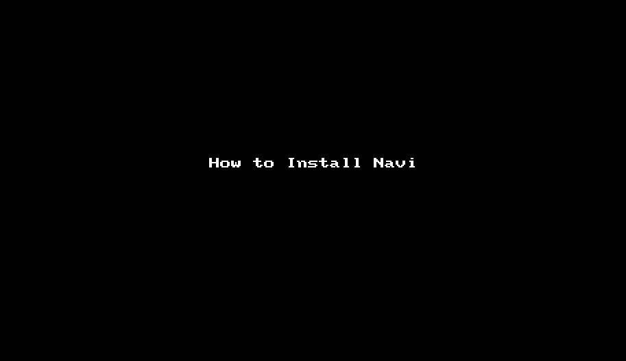
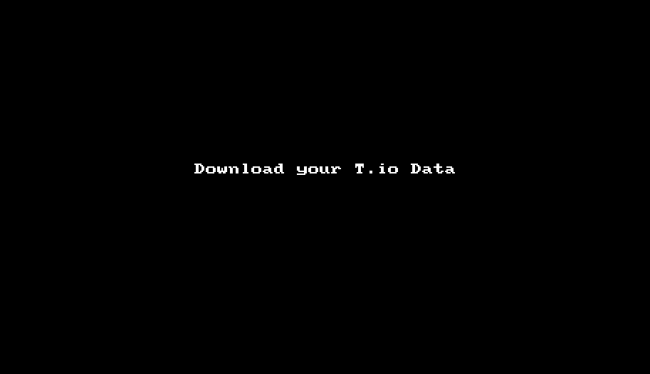
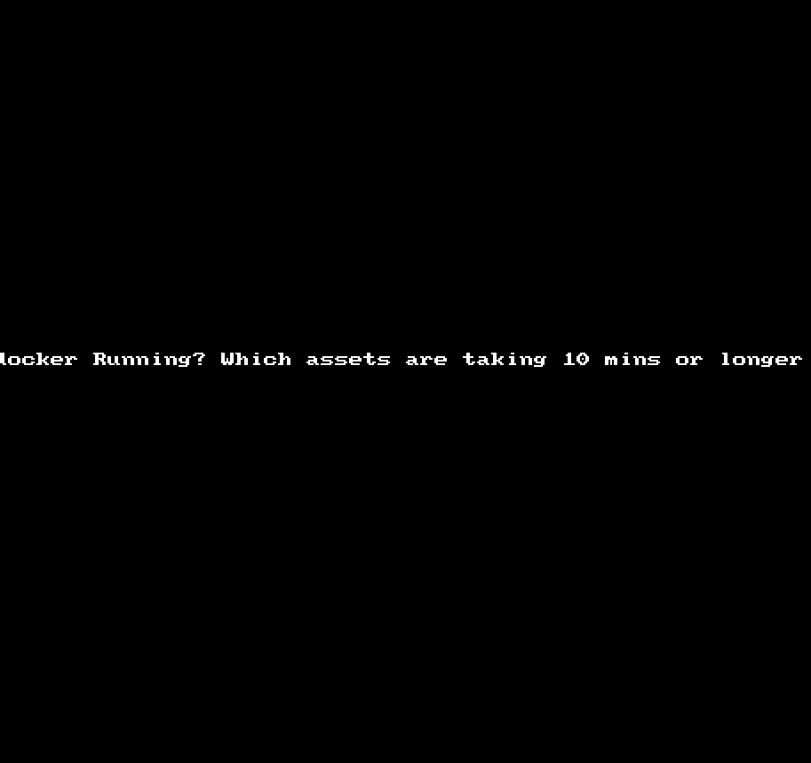

# Navi Pro - The Tenable.io Swiss Army Knife
A command-line tool which leverages the Tenable.io API to reduce the time it takes to get information that is common 
in Cyber Exposure or Vulnerability Management. *** This is not Supported by Tenable ***

### Important Note
Navi Pro will download the entire data-set(90 days) locally after API keys are 
entered and commands are run! To download Vuln and Asset data you have to be an Administrator in Tenable.io.

All Vulns and All Assets are downloaded into a SQLLITE database named navi.db.  
 
 Most of the API calls nessessary to make Navi work require access to
 your all of the available data.  Tenable.io has a 5000 record limit so Navi_pro.py utilizes the Export API.
 
 The data will not be updated until you run the update command.
 
    Navi_pro.py update
  
## Download and Configure Navi

    docker pull silentninja/navi_pro
  
    docker run -it -p 8000:8000 silentninja/navi_pro:latest /bin/bash 

    Navi_pro.py keys
    
   

     Navi_pro.py update
  
## Detach from Container
    CTR+Q+P - CTR+Q+P

## Attach to Contianer
    docker attach <container id>
  
    <press enter>

## Configure For Reporting
Navi has a few reporting capabilities where a CSV is the output.  To extract this data from the container you will need to launch the container with port 8000 exposed and use the 'http' command to extract the reports.

    docker run -it -p 8000:8000 silentninja/navi_pro:latest /bin/bash

### Extract Data
To extract data from the container you need to run an http server.  Use the below built in command.

    Navi_pro.py http

 * Navigate to the website: http://127.0.0.1:8000
 * Simply download the item you want by clicking on it.

## Usage
Before you begin you need the Keys! The program will continue to error out without valid API keys

    Navi_pro.py keys

Each command has two parts: the Command and the Option/Request. Double-Dash(--), commands expect a text value. Single-Dash commands do not have an expected input.  

There are ten core commands: 
 * api - query api endpoints
 * ip - find details on Specific IPs
 * find - Find information: credential failures, containers, etc
 * report - Report on Information: Latest scan information, Container vulns
 * list - List details: users, logs, etc
 * group - Create Target groups based off of Plugin ID, Plugin Name or Plugin Output
 * export - Export Agent or Asset data into a CSV
 * delete - Delete an object by it's ID
 * mail - Mail a report 
 * tag - Create a Category/Value Pair
 * lumin - Bulk adjust ACRs based on a tag
 
 There are fifteen single use commands: 
 * add - Manually Add an asset to Tenable.io
 * scan - Create and launch a scan
 * start - Start a scan by Scan-ID
 * pause - Pause a scan by Scan-ID
 * resume - Resume a scan by Scan-ID
 * stop - Stop a scan by Scan-ID
 * spider - Create a WebApp scan for every URL in a CSV
 * update - Update local Export Vuln and Asset data.
 * delete - Delete a scan by Scan ID
 * status - Get the latest status by Scan ID
 * mac - Get the manufacture by Mac Address
 * keys - Add or update your keys
 * http - Run an http server to extract files from the container
 * listen - Run a netcat listener to receive a single file
 * smtp - Enter or update your SMTP information
 
 

### Explore the Tenable.io API - 'api'
  Enter in a API endpoint and get a pretty print json ouput.  Try some of the below endpoints:
   * /scans
   * /scanners
   * /users

### Examples

    Navi_pro.py api /scans

    Navi_pro.py api /scanners
  
### IP address queries - 'ip'
  * --plugin TEXT --> Find Details on a particular plugin ID
  * -n --> Netstat Established and Listening and Open Ports
  * -p --> Patch Information
  * -t --> Trace Route
  * -o --> Process Information
  * -c --> Connection Information
  * -s --> Services Running
  * -r --> Local Firewall Rules
  * -d --> Scan Detail: 19506 plugin output
  * -patches --> Missing Patches
  * -software --> Find software installed on Unix of windows hosts
  * -outbound --> outbound connections found by nnm
  * -exploit --> Display exploitable vulnerabilities
  * -critical --> Display critical vulnerabilities
  * -details --> Details on an Asset: IP, UUID, Vulns, etc

### Examples

    Navi_pro.py ip 192.168.1.1 --plugin 19506

    Navi_pro.py ip 192.168.1.1 -details -software

### Find information - 'find'
  * --plugin TEXT --> Find Assets where this plugin fired
  * -docker --> Find Running Docker Containers
  * -webapp --> Find Web Servers running
  * -creds  --> Find Credential failures
  * --time TEXT --> Find Assets where the scan duration is over X mins
  * -ghost --> Find Assets found by a Connector and not scanned by Nessus(AWS ONLY)

### Examples

    Navi_pro.py find --plugin 19506
    
    Navi_pro.py find -docker

    Navi_pro.py find --time 10

### Reports - Information - 'report'
  * -latest -->  Report the Last Scan Details
  * --container TEXT --> Report Vulns of CVSS 7 or above by Container ID.
  * --docker TEXT --> Report Vulns of CVSS 7 or above by Docker ID
  * --comply TEXT --> Check to see if your container complies with your Policy
  * --details TEXT --> Report Scan Details including Vulnerability Counts by Scan ID
  * --summary TEXT --> Report Scan Summary by Scan ID

### Examples
    Navi_pro.py report -latest

    Navi_pro.py report --container 48b5124b2768

    Navi_pro.py report --docker 48b5124b2768

    Navi_pro.py report --comply 48b5124b2768

    Navi_pro.py report --summary 13

### List - Common Information - 'list'
  * -scanners --> List all of the Scanners
  * -users --> List all of the Users
  * -exclusions --> List all Exclusions
  * -containers --> List all containers and their Vulnerability  Scores
  * -logs --> List The actor and the action in the log file
  * -running --> List the running Scans
  * -scans --> List all Scans
  * -nnm --> Nessus Network Monitor assets and their vulnerability scores
  * -assets --> Assets found in the last 30 days
  * -policies --> Scan Policies
  * -connectors --> Displays information about the Connectors
  * -agroup --> Displays information about Access Groups
  * -status --> Displays Tenable.io License and Site information
  * -agents --> Displays information on Agents
  * -webapp --> Displays information on Web app Scans
  * -tgroup --> Displays information about Target Groups
  * -licensed --> Displays All of your Licensed assets
  * -tags --> Displays Tag Categories, Values and Value UUID
  * -categories --> Displays Tag Categories and the Category UUID
  
### Examples
    Navi_pro.py list -scanners

    Navi_pro.py list -running

    Navi_pro.py list -nnm

### Group Assets together - 'group'
  * -pid --> Create Target Group based a plugin ID
  * -pname --> Create Target Group by Text found in the Plugin Name
  * -pout TEXT --> Create a Target Group by Text found in the Plugin Output: Must supply Plugin ID
  * -aws --> Create a target group by AWS assets found by a connector but not scanned.

### Examples
    Navi_pro.py group 19506 -pid

    Navi_pro.py group Docker -pname

    Navi_pro.py group 20811 -pout Wireshark

    Navi_pro.py group aws

### Tag assets by Plugin Name, or Plugin ID - 'tag'
   * --c --> Create a Tag with this Category - Required
   * --v --> Create a Tag with this Value - Required
   * --d --> Create a description for your Tag - Optional (TEXT"
   * --plugin --> Define a Tag by a plugin ID - Optional (TEXT)
   * --name --> Define a tag by text found in a plugin Name - Optional (TEXT)
   * --group --> Defina a tag by a Agent Group Name - Optional (TEXT)
### Examples
    Navi_pro.py tag --c "My Category" --v "My Value" --d "My description" --plugin 93561
    Navi_pro.py tag --c "Application Vulns" --v "Java vulns" --name java
    Navi_pro.py tag --c "Agent Group" --v "Linux Agents" --group "Linux"
    
### Bulk Adjust ACRs based on a Tag - 'lumin'
   * --acr --> The new ACR value (1-10)
   * --c --> The Tag Category to use
   * --v --> The Tag value to use
   * --note --> Justification for ACR change
   
### Note - ACR Exceptions?
    Tag your assets with "NO:UPDATE" if you don't want to be affected by bulk ACR changes
    Category = NO
    Value = UPDATE
   
### Examples
    Navi_pro.py lumin --acr 10 --c "Applications" --v "Core Business" --note "Main application"

### Export Asset, Agent, Consec, or Webapp Data - 'export'

   * -assets --> Export Assets data into CSV: IP, Hostname, FQDN, UUID, exposure, etc
   * -agents --> Export Asset data into CSV: IP, Last Connect, Last scanned, Status
   * -webapp --> Export Web applications into a CSV: FQDN, Critical, High, Medium, Low
   * -consec --> Export Container Security summary info into a CSV.
   * -licensed --> Export a List of all Licensed Assets into a CSV.
   
### Examples

    Navi_pro.py export -assets
    
    Navi_pro.py export -agents -assets -webapp -consec -licensed

### Delete an Object by an ID
* scan - Delete a scan by ID
* agroup - Delete an Access group
* tgroup - Delete a Target Group
* policy - Delete a Policy
* asset - Delete an asset
* container - Delete a container by container ID
* tag - Delete a Tag value by Value UUID
* category - Delete a Tag category by the Category UUID

### Examples

    Navi_pro.py delete 1234 -scan

    Navi_pro.py delete 4567 -agroup

    Navi_pro.py delete 8910 -tgroup

    Navi_pro.py delete 12345 -asset

    Navi_pro.py delete 6789 -policy

### Mail a Report
* latest - Mail a report of the latest scan: Same output as "report -latest"
* consec - Mail a report of the ConSec Summary: Same output as "list -containers"
* webapp - Mail a report of the WebApp Summary

## Use Cases

### What was last scanned?
    Navi_pro.py report -latest

### What scans are running right now?
    Navi_pro.py list -running

### Find a Scan id by Scan Name
    Navi_pro.py list -scan | grep -b2 <ScanName>

### Create a Scan
    Navi.py scan 192.168.128.1
    
    Navi.py scan 192.168.128.0/24
    
  * Choose your scan type: Basic or Discovery
  * Pick your scanner by ID: scanners will be displayed
  * Scan will immediately kick off

### Control your scans
    Navi_pro.py pause 13

    Navi_pro.py resume 13

    Navi_pro.py stop 13

    Navi_pro.py start 13

### Find Available scanners
    Navi_pro.py list -scanners

### Create 100s of Webapp Scans from a CSV File
To Receive a file for Navi Pro to use you must push the file to the container.  Netcat is installed on the container to do this, or you can use the 'listen' command to accomplish this.
  
    Navi_pro.py spider <your_csv_file.csv>
    
    
* Choose your Scan type : Webapp Overview or Webapp Scan
* Choose your scanner: A list will be displayed
* Scans will be created but not started.
* An output of the Webapp URL and Scan ID will be displayed on completion

### Getting Data into the Container

From the container - Prepare your container to receive a file

    Navi_pro.py listen

    or

    nc -l -p 8000 > yourfilename.csv

From the computer with the file - Send the file

    nc containerhostIP 8000 < yourfilename.csv

